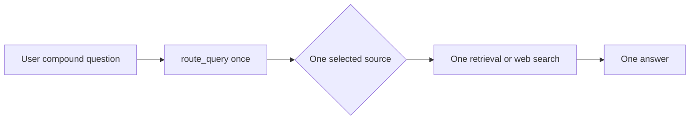
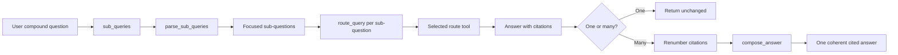
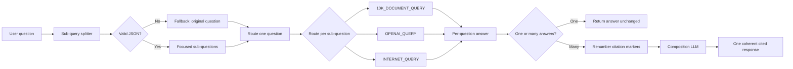
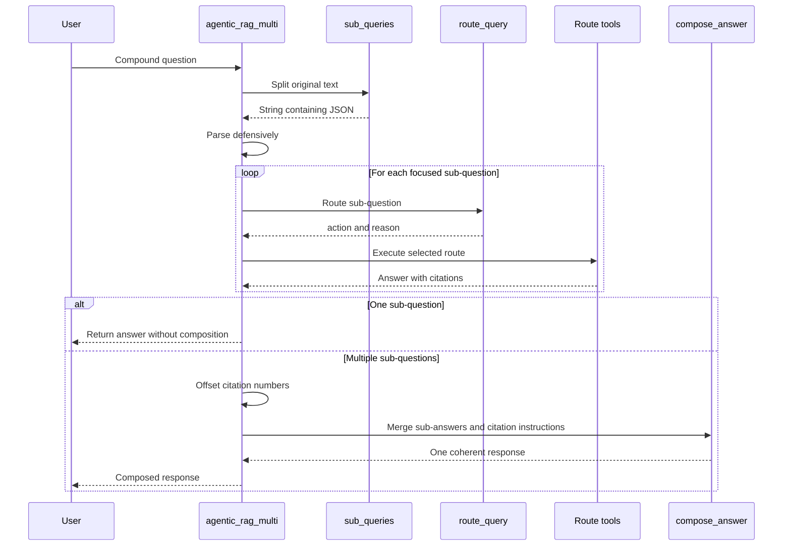
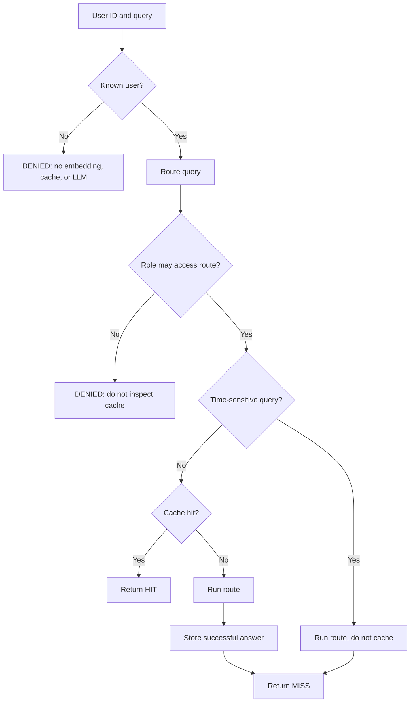

# Agentic Router: Sub-Query Division Design

**Companion document for:** `Agentic_Router.ipynb`  
**Assignment scope:** Part 1, Sub-query division  
**Optional extension:** RBAC-aware semantic caching

## 1. Purpose

The original agentic RAG flow treats every user question as one search. That works for a focused question, but a compound question can contain facts that belong to different sources. For example, a financial question may require the 10-K collection while a current technology question requires Internet search.

This design adds a decomposition layer before routing. Each focused sub-question is routed and answered independently, then the answers are composed into one response while preserving source citations.

The design follows the editorial diagram principles from [cathrynlavery/diagram-design](https://github.com/cathrynlavery/diagram-design): keep the visual vocabulary sparse, give the main path visual priority, use semantic labels, and avoid unnecessary infrastructure detail.

## 2. Goals and non-goals

### Goals

- Split a compound question into focused sub-questions.
- Route every sub-question independently.
- Support different sources within one user request.
- Preserve citations from each sub-answer.
- Avoid an unnecessary composition call for a single-question request.
- Treat malformed splitter output as a normal fallback case.
- Keep the existing `agentic_rag()` pipeline as the route execution mechanism.

### Non-goals

- Replacing the existing router or retrieval tools.
- Changing the underlying Qdrant collections or Internet search implementation.
- Adding a new agent framework.
- Claiming that decomposition solves ambiguity in every natural-language query.

## 3. Before and after

### Before: one question, one route

The original `agentic_rag(user_query)` flow sends the complete user query to the router once. The selected route then performs one retrieval or Internet search. A compound request is therefore forced through one source, even when its clauses need different sources.

### After: split, route, answer, compose

The new `agentic_rag_multi(user_query)` flow inserts a splitter before routing. Each focused sub-question gets its own route decision and answer. Multiple answers are citation-adjusted and composed; a single answer bypasses composition.

### Changes made

| Area | Before | After |
|---|---|---|
| Query handling | The full request was treated as one search | `sub_queries()` divides compound requests into focused questions |
| Routing | One route decision for the full request | `route_query()` runs independently for every sub-question |
| Source coverage | A compound request could use only one source | Different sub-questions can use 10-K, OpenAI docs, or Internet search independently |
| Model output parsing | No decomposition response to validate | `parse_sub_queries()` handles prose, code fences, malformed JSON, and invalid lists |
| Answer assembly | One route answer | Per-question answers are composed into one response |
| Citations | Citation numbers could collide when answers were combined | `renumber_citations()` offsets markers so sources remain distinct |
| Single-question behavior | Direct route answer | Same direct answer path, with no extra composition LLM call |
| Composition failure | No multi-answer fallback | Independent answers are returned in a readable stacked format |
| Testing | Manual example calls | Live examples plus deterministic regression tests for parsing, routing, composition, and citations |

This change is intentionally additive: the existing route tools, retrieval collections, and `agentic_rag()` behavior remain in place. The new function reuses those route tools rather than duplicating retrieval logic.

## 4. High-level architecture

The important boundary is between `Sub-query splitter` and `Route one question`. Routing happens after decomposition and is repeated for every sub-question. The system never assumes that all pieces of a compound request belong to the same source.

## 5. Request sequence

## 6. Component responsibilities

| Component | Responsibility | Failure behavior |
|---|---|---|
| `sub_queries()` | Ask the model to return `{"subQuestions": [...]}` as a string | Caller falls back to the original question if the call fails |
| `parse_sub_queries()` | Remove code fences, extract JSON, validate the list, trim strings | Returns `[fallback]` for malformed, empty, or invalid data |
| `answer_sub_query()` | Route and execute one focused question | Converts route execution failures into an answer string |
| `run_route()` | Reuse the existing synchronous/asynchronous route conventions | Returns an unsupported-action message for unknown routes |
| `renumber_citations()` | Make citation markers unique across sub-answers | Leaves text unchanged when no numeric citations exist |
| `compose_answer()` | Ask one model call to merge answers without inventing or dropping citations | Caller returns the sub-answers stacked if composition fails |
| `agentic_rag_multi()` | Orchestrate splitting, independent routing, execution, and composition | Always attempts to return a useful answer rather than crashing |

## 7. Core design decisions

### 6.1 Decompose before routing

A compound question must not be routed as one unit. Routing each focused sub-question allows the following request to use two sources:

- `what was Uber's 2021 revenue?` -> `10K_DOCUMENT_QUERY`
- `what are the newest LLMs?` -> `INTERNET_QUERY`

This is the primary correctness requirement for Part 1.

### 6.2 Defensive parsing

The splitter returns model-generated text, not a typed Python object. The parser therefore accepts JSON surrounded by prose or a Markdown code fence. It validates that `subQuestions` contains at least one non-empty string. Any failure falls back to the complete original question, preserving the original agent behavior instead of terminating the request.

### 6.3 Citation uniqueness

Each retrieval answer can start numbering its sources at `[1]`. If two answers are concatenated without adjustment, the same marker could refer to different documents. Before composition, the implementation shifts later markers by the highest citation number already used. The composition prompt then instructs the model to retain the resulting markers and source URLs.

### 6.4 Single-question fast path

A single sub-question returns its route answer directly. This preserves the original behavior and avoids an unnecessary synthesis LLM call. The splitter call is still performed because it is part of the assignment contract.

### 6.5 Optional concurrency

The implementation exposes `concurrent=True`. In that mode, independent sub-queries run in worker threads and asynchronous document routes use their own event loops. Composition remains sequential because it depends on all per-question answers. The default remains sequential for easier debugging and predictable notebook execution.

## 8. Optional RBAC and semantic cache

The notebook also contains an optional extension. The cache is partitioned by route label rather than by user ID or role. This lets users who share access to `OPENAI_QUERY` reuse an answer while still preventing a user from reading a partition for a source they cannot access.

The request order is deliberately security-sensitive:

Permission is checked against the current role on every cache operation. If a role changes, entries for newly forbidden sources become unreachable immediately; entries for newly permitted sources may become available without re-keying the cache. If access later becomes file- or chunk-level rather than source-level, the cache partition must include the exact permitted source set or retrieval filter.

## 9. Validation plan and observed results

The notebook includes live examples and a saved deterministic regression-test cell. The regression tests stub external model and retrieval calls so the control-flow checks can run repeatedly without extra API usage.

| Test | Expected result | Observed result |
|---|---|---|
| Single revenue question | One sub-query, one 10-K route, no composition call | Passed |
| Two financial questions | Two sub-queries, both 10-K routes | Passed in live notebook example |
| Financial plus newest LLMs | Separate 10-K and Internet routes | Passed in live notebook example |
| JSON inside a code fence | Extract two sub-questions | Passed |
| Malformed JSON | Fall back to the original question | Passed |
| Citation composition | Preserve distinct `[1]` and `[2]` markers | Passed |

The saved regression cell prints `Part 1 regression tests passed.` when these assertions succeed.

## 10. Risks and mitigations

| Risk | Mitigation |
|---|---|
| The splitter misunderstands the question | Fall back safely; the existing single-query pipeline still runs |
| A sub-answer has no citations | Citation renumbering leaves it unchanged; composition is instructed not to invent sources |
| Composition fails | Return the independently generated answers in a readable stacked format |
| A current answer becomes stale in the cache | Skip caching time-sensitive queries |
| Cache leaks across permissions | Route and enforce RBAC before cache lookup; partition by permitted source |
| Parallel execution complicates async state | Use a separate event loop per worker thread and keep sequential mode as default |

## 11. Submission summary

The required Part 1 implementation is contained in the notebook function `agentic_rag_multi(user_query)`. It adds decomposition, independent routing, citation-safe composition, a single-question fast path, and malformed-output fallback while reusing the notebook's existing route functions.

The notebook is the executable submission, saved as `Agentic_Router.ipynb`. This document is the accompanying design explanation and can be attached alongside it.
